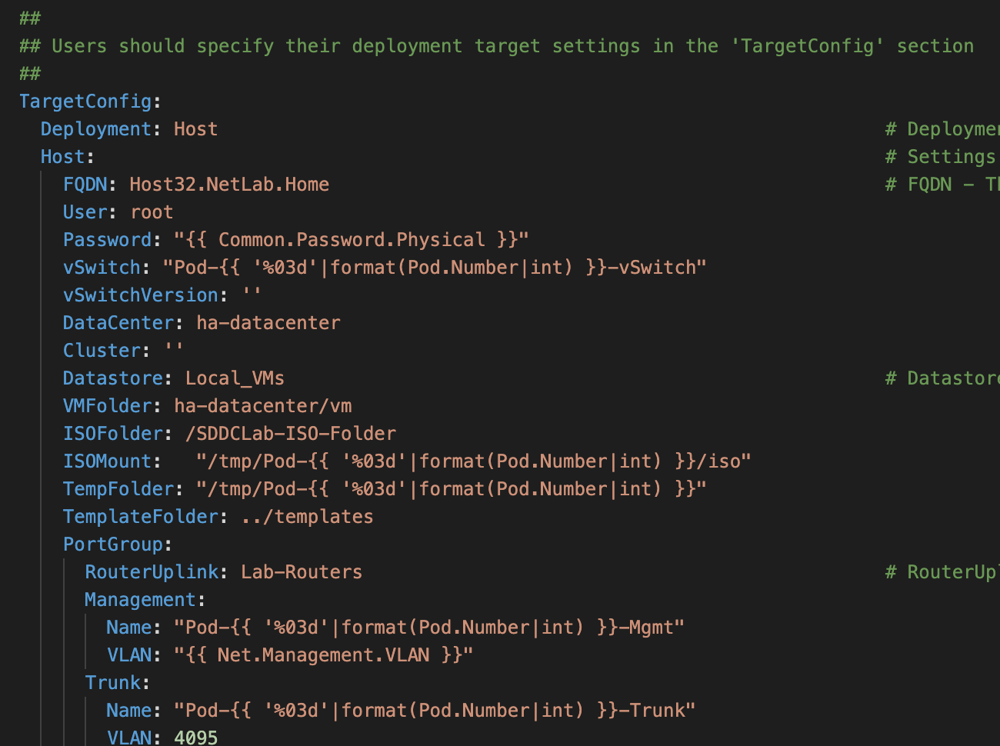

     _________________  _____       _           _     
    /  ___|  _  \  _  \/  __ \     | |         | |    
    \ `--.| | | | | | || /  \/     | |     __ _| |__  
     `--. \ | | | | | || |         | |    / _` | '_ \ 
    /\__/ / |/ /| |/ / | \__/\  _  | |___| (_| | |_) |
    \____/|___/ |___/   \____/ (_) \_____/\__,_|_.__/ 

# Deploying your first SDDC.Lab Pod

## Table of Contents
* [Configure your physical network](#Configure-your-physical-network)
* [Configure your physical ESXi host](#Configure-your-physical-ESXi-host)
* [Install your Ansible Controller](#Install-your-Ansible-Controller)
* [Prepare your Pod configuration files](#Prepare-your-Pod-configuration-files)
  * [config.yml](#configyml)
  * [licenses.yml](#licensesyml)
  * [software.yml](#softwareyml)
* [Create your software library](#Create-your-software-library)
* [Generate your Pod configuration](#Generate-your-Pod-configuration)
* [Start your Pod deployment](#Start-your-Pod-deployment)
* [Access your Pod's components](#Access-your-Pod's-components)

## Configure your physical network (TBD)

## Configure your physical ESXi host
Currently the scripts supports deploying Pods on a standalone ESXi host. This host must be running ESXi version 6.7 or later. After installing ESXi make sure that you configure the following:

* A datastore
* A portgroup configured with the VLAN ID of the Router Uplink segment (e.g. Lab-Routers)

## Install your Ansible controller

The Ansible controller is the machine from which you will run the Ansible scripts. We recommend installing a modern version of [Ubuntu](https://ubuntu.com/download) on a dedicated virtual machine. This VM can be connected to any VLAN as long as it:

* Can access the physical ESXi host
* Can reach the Router Uplink segment and the Pod networks behind the [VyOS](https://www.vyos.io/) router
* Has Internet access

### Software
After you've installed the Ubuntu OS and applied the latest updates, some additional software is required to turn this machine into an Ansible controller for your SDDC.Lab Pods. You can simply copy and paste the commands below. Installation of the additional software will only take some minutes.

1. Python, pip, and xorriso:  
**sudo apt install python3 python3-pip xorriso**

1. Ansible and the required Python modules:  
**sudo pip3 install ansible pyvim pyvmomi netaddr jmespath dnspython==1.16.0**

1. The SDDC.Lab repository cloned to an appropriate location on your Ubuntu machine (e.g. $HOME) with:  
**git clone https://github.com/rutgerblom/SDDC.Lab.git**

## Prepare your Pod configuration files
After cloning the repository you will end up with a directory called "SDDC.Lab" with the following contents:

    hosts
    images
    library
    module_utils
    playbooks
    plugins
    templates
    utils
    ansible.cfg
    CHANGELOG.md
    FirstPod.md
    README.md
    config_sample.yml
    deploy.yml
    licenses_sample.yml
    software_sample.yml
    undeploy.yml

Three files in the root of the SDDC.Lab directory require your attention:
* config_sample.yml
* licenses_sample.yml
* software_sample.yml

Start by creating your own copies of the sample configuration files:
* cp config_sample.yml config.yml
* cp licenses_sample.yml licenses.yml
* cp software_sample.yml software.yml

### config.yml
This file contains all of the configuration and settings for the Pod you're about to deploy. Its contents are organized in several different sections and data structures.
 

 
There are many settings that you ***can*** change, but only a few that you ***must*** change. Especially when deploying your first Pod we strongly recommend that you keep changes to a minimum. The table below contains the settings that ***must*** match your environment:
 
| Setting                                  | Description                                                                                                          | Default Value
| :---                                     | :---                                                                                                                 | :---
| Common.Password.Physical                 | The root password of your physical ESXi host                                                                         | VMware1!
| Common.DNS.Server1.IPv4/IPv6             | The IP address of the DNS server to be used by the nested environment. Only change this if Deploy.DNSServer == false | 10.203.0.5
| Common.NTP.Server1.IPv4/IPv6             | The IP address of the NTP server to be used by the nested environment. Only change this if Deploy.DNSServer == false | 10.203.0.5
| TargetConfig.Host.FQDN                   | The FQDN of your physical ESXi host                                                                                  | Host32.NetLab.Home
| TargetConfig.Host.Datastore              | The datastore on your physical ESXi host                                                                             | Local_VMs
| TargetConfig.Host.PortGroup.RouterUplink | The portgroup that connects your Pod to your physical network                                                        | Lab-Routers
| Nested_Router.Protocol                   | The routing method for routing traffic between your Pod and your physical network                                    | OSPF

Change either your environment or these settings so that they match!

### licenses.yml (TBD)
In licenses.yml you store your license keys for the different products. 
cp licenses_sample.yml config.yml

### software.yml (TBD)
In software.yml we've defined the poducts and versions that can be deployed with the scripts.
cp software_sample.yml config.yml

## Create your software library (TBD)

## Generate your Pod configuration (TBD)

## Start your Pod deployment (TBD)

## Access your Pod's components (TBD)