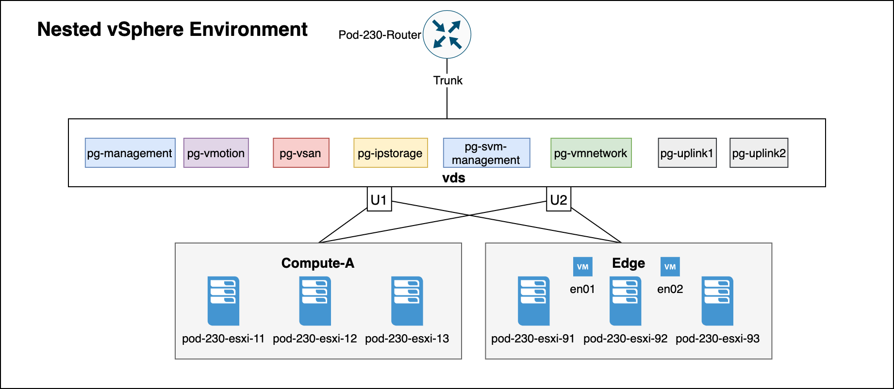
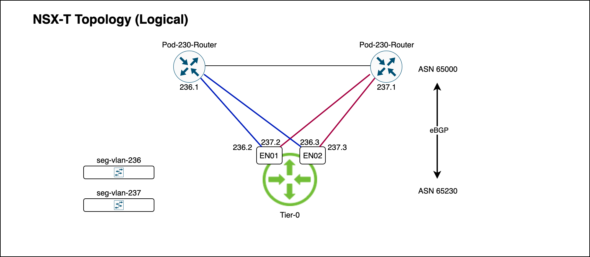

# vsphere-nsxt-lab-deploy
A set of Ansible Playbooks that automate the deployment and configuration of a complete nested vSphere environment and NSX-T.

#### Table of Contents

* [Description](#Description)
* [Changelog](#Changelog)
* [Requirements](#Requirements)
* [Usage](#Usage)
* [Compatibility](#Compatibility)
* [The Deployment](#The-Deployment)
* [Diagrams](#Diagrams)
* [Development](#Development)
* [Credits](#Credits)

## Description

This repository contains a set of Ansible Playbooks that will deploy and configure vCenter, nested ESXi, NSX-T Manager, and NSX-T Edge nodes. The primary use case is speedy provisioning of a consistent nested lab environment.

## Changelog

* **12/04/2020**
  * Initial release
* **25/04/2020**
  * Added an optional VyOS router to the deployment

## Requirements

* A physical ESXi host
* An Ubuntu 18.04 VM with the following packages:
  * apt install python3 python3-pip sshpass xorriso
  * pip3 install ansible pyvim pyvmomi
  * ovftool (free download from [VMware](https://www.vmware.com/support/developer/ovf))
* ESXi and VCSA ISO files as well as the NSX-T Manager OVA file
* If deploying NSX-T you'll need an NSX-T license (Check out [VMUG Advantage](https://www.vmug.com/membership/vmug-advantage-membership) or the [NSX-T Product Evaluation Center](https://my.vmware.com/web/vmware/evalcenter?p=nsx-t-eval))

## Usage

Edit **answerfile.yml** and **deploy.yml** according to your needs. 

Start the deployment with: **ansible-playbook deploy.yml**

Remove the deployment with: **ansible-playbook undeploy.yml**

## Compatibility

The following versions of vSphere and NSX-T can be deployed:
* ESXi version 6.7 and 7.0
* vCenter version 6.7 and 7.0
* NSX-T version 2.5 and 3.0

## The Deployment

Using the default **deploy.yml** the following is deployed:
1. vSwitch and port groups on the physical ESXi host
1. VyOS router
1. vCenter Sever Appliance
1. 5 ESXi VMs
1. Configuration of the nested vSphere environment:
   * The ESXi hosts
   * Distributed Switch
   * vSphere clusters
1. NSX-T:
   * NSX Manager
   * vCenter Compute Manager (the deployed vCenter Server Appliance)
   * Transport Zones
   * IP pool
   * Uplink Profiles
   * Transport Node Profile
   * Two NSX-T Edge Transport Nodes
   * Edge Cluster
   * ESXi Transport Nodes ("Compute" cluster)
   * Tier-0 Gateway

Ansible Play recap from 25/04/2020:

### Diagrams

The following diagrams show what is deployed when using the default settings in **answerfile.yml**

A diagram of the physical environment.

A diagram of the nested vSphere environment.

A diagram of the NSX-T logical network.

## Development

* TODO: Add more Playbooks for NSX-T logical networking
* TODO: Optimize / structurize answerfile.yml

## Credits

A lot of credits go to **Yasen Simeonov** and his project at https://github.com/yasensim/vsphere-lab-deploy.
